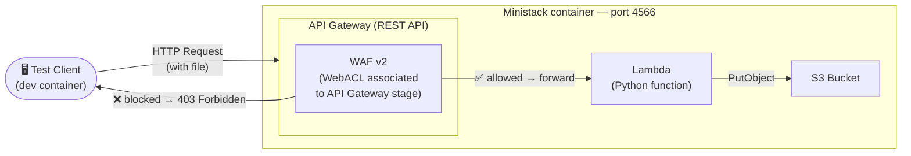

```mermaid
flowchart LR
    Client(["🖥️ Test Client\n(dev container)"])

    subgraph ministack["Ministack container — port 4566"]
        subgraph apigw["API Gateway (REST API)"]
            WAF["WAF v2\n(WebACL associated\nto API Gateway stage)"]
        end
        Lambda["Lambda\n(Python function)"]
        S3["S3 Bucket"]
    end

    Client -->|"HTTP Request\n(with file)"| apigw
    WAF -->|"❌ blocked → 403 Forbidden"| Client
    WAF -->|"✅ allowed → forward"| Lambda
    Lambda -->|"PutObject"| S3
```